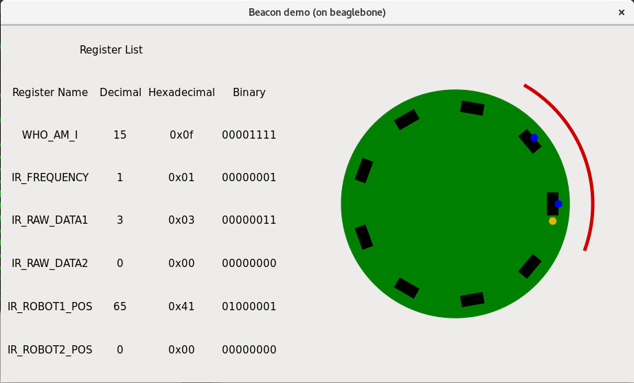

# BeagleboneDemo

This folder contains two demos of the beacon receiver:
 - a basic, command line demo, giving the current sensor state.
 - a graphical demo using GTK to render in a window all register states and a rendering of the receiver.

This code was written for a Beaglebone Black, but should run fine on a Raspberry Pi.

## Wiring

Wire both grounds together, and the beacon Vin to the 3.3V power supply (pins P9.3 and P9.4). Don't use 5V: this won't
break anything but the communication with the board most likely won't work (I2C is open drain so no high voltage
will be send to the board which will run fine in 5V. But it's likely it won't read correctly the 3.3V signals from the
Beaglebone).

Wire the I2C to I2C-2 of the Beaglebone (name i2c-1 in the code - kernel mapping is shifted by one): SCL on P9.19, SDA on P9.20.
For Raspberry Pi, wire Vin to pin 1, SCL to pin 5, SDA to pin 3 and GND to pin 6.

## Command line demo

To compile this code, copy the `src` directory to the Beaglebone, then in the parent directory type:

```
gcc -std=gnu99 -Wall -o BeaconCmdLineDemo src/BeaconCmdLineDemo.c src/BeaconDriver.c src/I2C-Wrapper.c
```

The execute using:
```
./BeaconCmdLine
```

This should give you an output of the form:

```
Sensor state (0: off, 1: active, emitter is seen)
0	1	2	3	4	5	6	7	8
1	1	0	0	0	0	0	0	0
```

## Graphical demo

This demo is associated to a Makefile: to compile, simply copy the Makefile on the Beaglebone, together with the sources,
and type `make`. GTK library is needed to compile this code, but it is installed by default on the Beaglebone.

To run, if you are connected through ssh, you need to allow the Beaglebone to use you PC screen to dispay the graphical
window. This is done by adding a -X to the ssh command: thus, connect to the Beaglebone using:

```
ssh root@192.168.7.2 -X
```
Otherwise, you will get a warning of the form `Gtk-WARNING **: cannot open display:` and the code will terminate.

Then simply run the demo:

```
./BeaconDemo
```

You should see a window like this one:


The right column shows the current value of all registers ; the left hand side is a drawing of the receiver. All the
sensors which currently see the receiver have a blue dot on them. The red arc shows the corresponding robot, as defined
by the ROBOT_POS registers.
