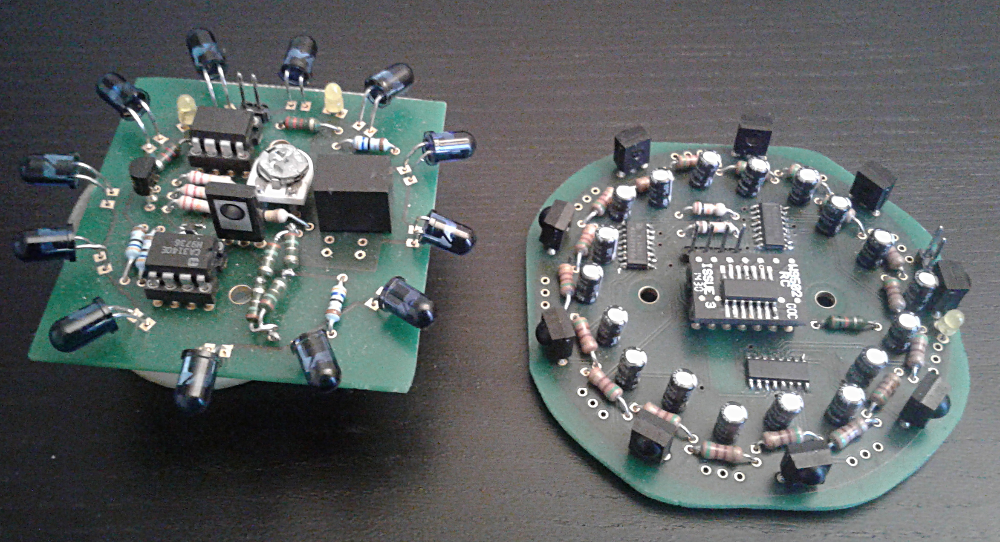

# eurobot_beacon

## Infrared beacon system for robot detection in Eurobot

This repo contains the full design (hardware and software) of a beacon system for Eurobot. Its aim is to give the positioning
of the other team's robots, using an IR emitter fixed on their robot, and a belt of IR receivers, giving a 360° field of view.
The receiver was deisgn so as to be as easy to use as possible: as such, an onboard microcontroller handles individual
sensor readings, which requiers constant interrupts. Data is made available to the master controller by a simple I2C interface. The receiver
can run from 5V or 3.3V power supply, making it directly interfacable with boards like Arduino, Raspberry or Beaglebone.

Experimentaly, this board gave good results ; however due to timing constraints, it has not so far been tested in the
actual Eurobot competition. Feel free to use this design, and modify it as you wish !

For an explaination of the changes since the first protytpe, please view the [DesignUpdate.md](DesignUpdate.md) file.

_Ce repo contient le design complet (électronique et logiciel) d'un systèmes de balises pour la Coupe de France de Robotique (Eurobot).
Ce système cherche à détecter les robots de l'équipe adverse, à l'aide d'un émetteur infrarouge placé sur leur robot, et d'une
ceinture de récepteurs garantissant un champ de vision à 360°. Le récepteur a été concu avec pour objectif d'avoir une interface
la plus simple possible à utiliser: ainsi, un microcontrôleur embarqué s'occupe de la lecture individuelle des capteurs, à l'origine
d'interruptions constantes dans le code. Les données sont rendus disponibles par une simple liaison I2C. Le récepteur peut
de plus fonctionner en 3.3V ou 5V, ce qui le rend directement utilisables par un grand nombre de cartes telles qu'Arduino,
Raspberry ou Beaglebone._

## Getting started

To get familiar with this project, you should first read the [BeaconDesign](Documentation/BeaconDesign.pdf) file, which
describes how and why these beacons were developped. Once you have built the boards and programmed the onboard microcontrollers,
the BeagleboneDemo code is probably a good place to start - if you have a Beaglebone or Raspberry Pi, you can use it
to see a graphical test of the boards.

## Contents

 - **Documentation:** the full documentation of the system. It describes the design ideas beind these boards, as well
 as necessary informations to use the receiver (sensor layout, I2C register mapping).
 - **Electronics:** the schematics and PCBs of the emitter and the receiver, designed using the free software
 [Designspark 8.0](https://www.rs-online.com/designspark/pcb-download-and-installation). A third PCB is provided, an ATTiny
 programmer board to flash this code using an Arduino.
 - **BeaconCode:** both the emitter and the receiver contain an ATTiny microntroller, whose code is contained is this folder.
 - **BeagleboneDemo:** a gui demo of the beacon. This demo was written and tested on a Beaglebone Black board, but with
 minimal adaptation should work for a Raspberry Pi as well. Simply plug the receiver, and watch graphically its full status
 in real time.

